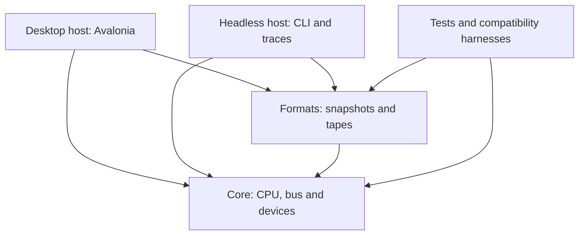

# Architecture
Status: accepted design; implemented scope is the CPU load/byte ALU/control/stack slices listed in README and
[opcode coverage](z80-coverage.md). Spectrum devices, formats and complete save states are future work.

## Product and scope
RockULA! is both a playable emulator and an inspectable model of a historical computer.
The first release target is a desktop Spectrum 48K emulator with user-supplied firmware and
snapshots. Accuracy is earned through measured tests; do not advertise cycle accuracy while
only instruction-level correctness has been checked.

The implementation language is C#. The baseline is .NET 10; Avalonia 12.1.3 is confined to
the desktop host. This is a new hardware implementation, not an interface over an upstream core.
No C/C++ source is authored for the emulator. Avalonia's rendering stack can contain native
dependencies; this design is not a claim that every transitive dependency is managed code.

## Dependency graph

| Project | Owns | Must not own |
| --- | --- | --- |
| Core | Z80, machine memory, ULA, ports, tape signal, beeper, complete hardware state | UI, file paths, host audio, network, wall time |
| Formats | Validated decoding/encoding into portable states and tape descriptions | Machine execution, UI dialogs, patching a running machine |
| Headless | File input, CLI, execution budgets, hashes, trace/report output | Separate CPU implementation or timing model |
| Desktop | Window, input mappings, framebuffer presentation, audio output, pacing | Mutating guest registers from the render thread |
| Tests | Synthetic fixtures, expected states, bus traces, regression evidence | Hidden dependence on copyrighted ROMs or network downloads |

No shared UI project is needed for the welcome shell. Add `RockULA.App` only when a second host
actually needs common views/view-models. A browser project is deferred; preserve portability in
Core now without inventing unused browser adapters.

## Core decomposition (planned)
- `Cpu/`: registers and execution state, opcode dispatch, ALU/flags, bus-cycle sequencing.
- `Memory/`: model-specific mapping, RAM, firmware references and untimed inspection.
- `Machines/`: profile, device wiring, scheduler, reset, instruction/frame execution and state.
- `Video/`: ULA raster/fetch pipeline, attributes, FLASH, border events, framebuffer output.
- `Input/`: active-low keyboard matrix, joystick state and timestamped input changes.
- `Audio/`: beeper transitions, deterministic sampling/filter state; AY comes with 128K.
- `Tape/`: pulse cursor and EAR level driven by hardware time.
- `Debugging/`: read-only inspection, breakpoints and optional bounded trace collection.

These are responsibility boundaries, not instructions to create empty directories or interfaces
before a milestone needs them. Prefer direct, readable code to reflection-heavy device discovery.

## Machine model
The 48K address map has firmware at 0x0000–0x3FFF and RAM at 0x4000–0xFFFF. The first 16 KiB
of RAM is the contended region; bitmap and attributes sit within it. ROM writes have no effect
on firmware. Debugger/snapshot access is distinct from timed CPU bus access.

Choose and document an NMOS Z80 and 48K ULA Issue 3 profile. Store frame phase, contention,
interrupt line, floating-bus and EAR details with that profile. A nominal CPU clock is not a
license to round the video refresh to exactly 50 Hz. Exact rules live in
[timing](timing.md); implementation constants need specific references and regression vectors.

Firmware is an immutable, validated input identified by a hash. Startup without required firmware
shows a clear actionable error; a zero-filled buffer is never presented as a working Spectrum ROM.
The current shell requires none because it does not start a machine.

## Host integration
One worker owns machine state on desktop. Commands cross into that owner at specified
instruction or device-safe boundaries. The GUI consumes published frame buffers and inspection
snapshots; the audio callback consumes a bounded PCM queue. Pausing, resetting, loading state and
closing the app coordinate on the owner, with explicit completion and cancellation.

Host pacing follows produced audio and bounded wall-clock drift. It may drop presentation frames
but never guest cycles to catch up. Turbo changes delivery/pacing, not the CPU's hardware model.
Headless runs use an execution budget and no sleeps. Browser support must use its own scheduling
and audio adapter; desktop threading assumptions cannot become Core requirements.

## Scope deliberately deferred
128K banking and AY, TZX's full block set, disk/TR-DOS, Pentagon, rewind, game catalogue,
cloud saves, mobile UX and a full debugger. Basic inspect/step/trace tooling arrives earlier to
make failures diagnosable. Save-state and input-replay contracts are designed before rewind.
